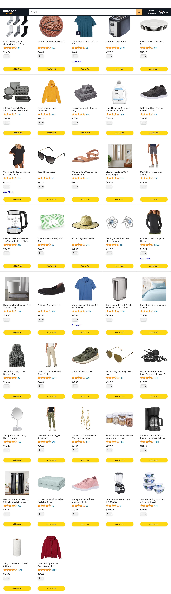
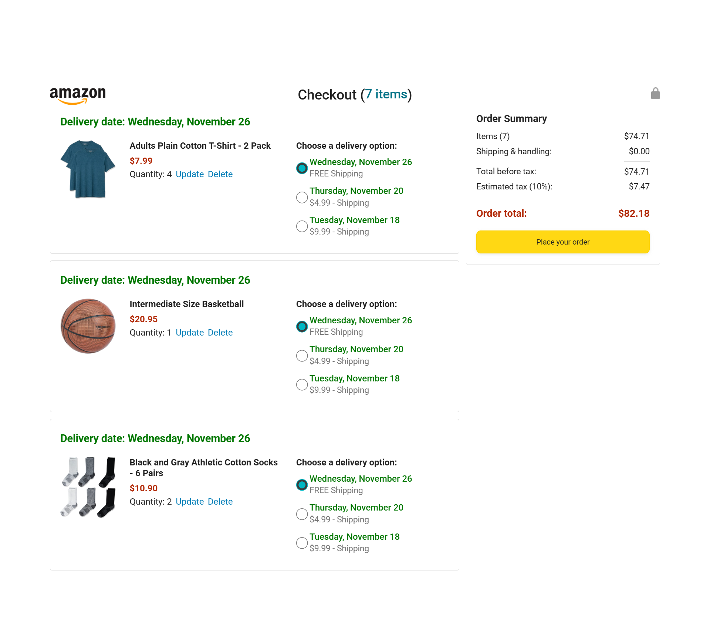
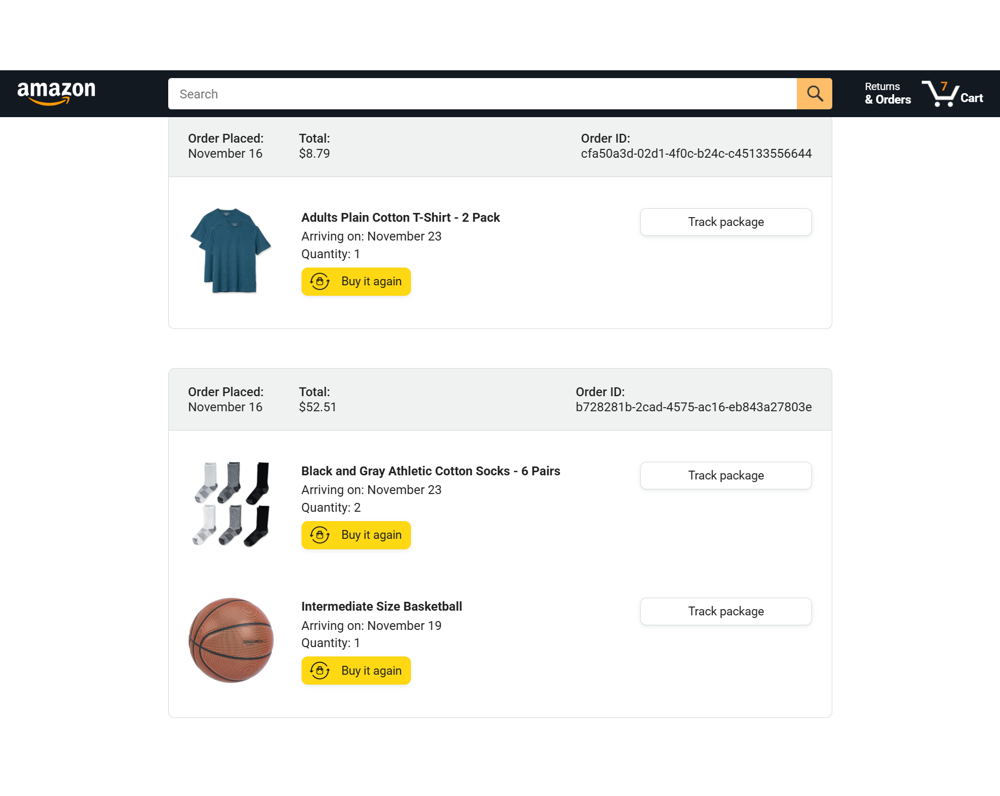

# Amazon-like E-commerce Project (JavaScript)

This is a lightweight, front-end focused Amazon-style e-commerce project implemented with plain JavaScript, HTML and CSS. It demonstrates product listing, a shopping cart, checkout flow, orders tracking, and small utilities for money formatting and tests.

**Highlights**
- **Vanilla JavaScript**: No frameworks — meant for learning core web development concepts.
- **Modular structure**: Separate pages and scripts for `amazon`, `checkout`, `orders`, and `tracking`.
- **Cart implementations**: Multiple `cart` implementations in `data/` for practice (OOP, class-based, functional).
- **Simple backend**: `backend/products.json` provides product sample data used by the app.
- **Tests**: Small test files located in `tests/` and `tests-jasmine/` to validate utilities.

**Quick demo screenshots**

Front page / product listing:

Cart & checkout summary:

Order tracking / confirmation:

Project structure (top-level)

- `amazon.html` — main product listing page
- `checkout.html` — checkout flow
- `orders.html` — past orders
- `tracking.html` — delivery tracking
- `backend/` — sample data (`products.json`)
- `data/` — practice modules and cart implementations
- `scripts/` — page-specific JS (`amazon.js`, `checkout.js`, etc.)
- `styles/` — CSS organized by pages and shared styles
- `tests/`, `tests-jasmine/` — unit tests and test harness
